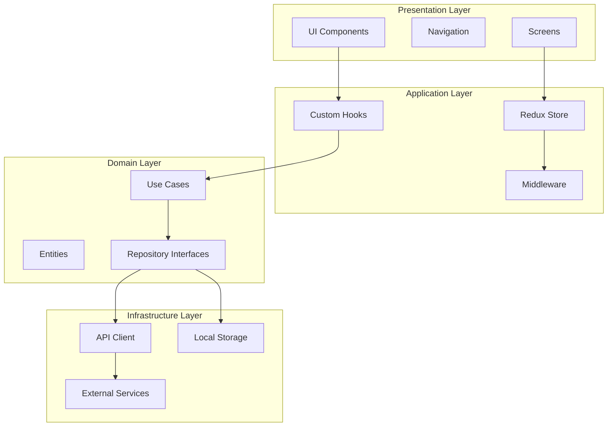
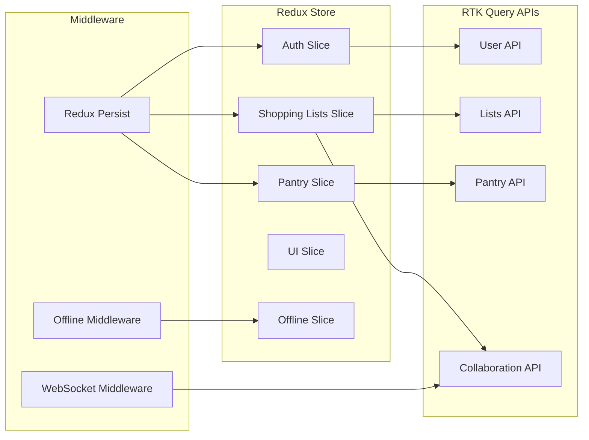
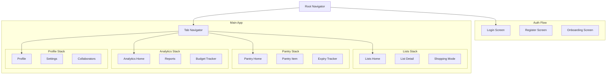
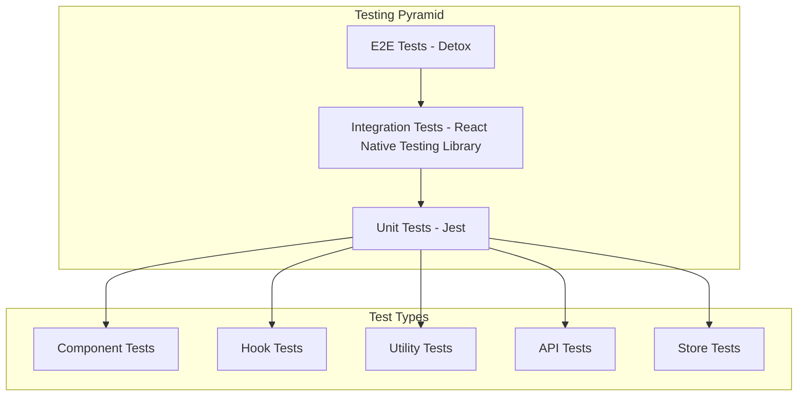

# Design Document

## Overview

This design document outlines the technical architecture for PentryPal's React Native infrastructure. The design implements a scalable, maintainable, and high-performance cross-platform mobile application following Clean Architecture principles, with comprehensive offline support, real-time collaboration, and enterprise-grade security.

The architecture emphasizes separation of concerns, testability, and maintainability while ensuring optimal performance and user experience across iOS and Android platforms.

## Architecture

### High-Level Architecture



### Clean Architecture Implementation

The application follows Clean Architecture principles with four distinct layers:

1. **Presentation Layer**: React Native components, screens, and navigation
2. **Application Layer**: State management, custom hooks, and application logic
3. **Domain Layer**: Business entities, use cases, and repository interfaces
4. **Infrastructure Layer**: External services, APIs, and data persistence

### Folder Structure

```
src/
├── presentation/
│   ├── components/
│   │   ├── atoms/
│   │   ├── molecules/
│   │   ├── organisms/
│   │   └── templates/
│   ├── screens/
│   ├── navigation/
│   └── hooks/
├── application/
│   ├── store/
│   │   ├── slices/
│   │   ├── api/
│   │   └── middleware/
│   ├── services/
│   └── utils/
├── domain/
│   ├── entities/
│   ├── usecases/
│   └── repositories/
├── infrastructure/
│   ├── api/
│   ├── storage/
│   ├── services/
│   └── config/
└── shared/
    ├── constants/
    ├── types/
    ├── utils/
    └── validation/
```

## Components and Interfaces

### State Management Architecture



### Component Architecture

```typescript
// Atomic Design Structure
interface ComponentHierarchy {
  atoms: {
    Button: React.FC<ButtonProps>;
    Input: React.FC<InputProps>;
    Icon: React.FC<IconProps>;
    Text: React.FC<TextProps>;
  };
  molecules: {
    SearchBar: React.FC<SearchBarProps>;
    ListItem: React.FC<ListItemProps>;
    FormField: React.FC<FormFieldProps>;
  };
  organisms: {
    ShoppingList: React.FC<ShoppingListProps>;
    NavigationHeader: React.FC<NavigationHeaderProps>;
    CollaboratorPanel: React.FC<CollaboratorPanelProps>;
  };
  templates: {
    ScreenTemplate: React.FC<ScreenTemplateProps>;
    ModalTemplate: React.FC<ModalTemplateProps>;
  };
}
```

### Navigation Architecture



### API Integration Architecture

```typescript
// RTK Query API Structure
interface APIArchitecture {
  baseApi: {
    reducerPath: 'api';
    baseQuery: fetchBaseQuery({
      baseUrl: '/api/v1',
      prepareHeaders: (headers, { getState }) => {
        // Add auth token, request ID, etc.
      },
    });
    tagTypes: ['User', 'List', 'Item', 'Pantry', 'Collaborator'];
  };

  endpoints: {
    // User Management
    getUserProfile: builder.query<User, void>();
    updateUserProfile: builder.mutation<User, Partial<User>>();

    // Shopping Lists
    getShoppingLists: builder.query<ShoppingList[], void>();
    createShoppingList: builder.mutation<ShoppingList, CreateListRequest>();
    updateShoppingList: builder.mutation<ShoppingList, UpdateListRequest>();

    // Real-time Collaboration
    subscribeToListUpdates: builder.query<ListUpdate[], string>();
    assignItemToCollaborator: builder.mutation<void, AssignItemRequest>();
  };
}
```

## Data Models

### Core Entities

```typescript
// Domain Entities
interface User {
  id: string;
  email: string;
  displayName: string;
  avatar?: string;
  preferences: UserPreferences;
  createdAt: Date;
  updatedAt: Date;
}

interface ShoppingList {
  id: string;
  name: string;
  description?: string;
  ownerId: string;
  collaborators: Collaborator[];
  items: ShoppingItem[];
  categories: Category[];
  status: ListStatus;
  budget?: Budget;
  createdAt: Date;
  updatedAt: Date;
}

interface ShoppingItem {
  id: string;
  name: string;
  description?: string;
  quantity: number;
  unit: string;
  category: Category;
  assignedTo?: string;
  completed: boolean;
  price?: number;
  notes?: string;
  barcode?: string;
  createdAt: Date;
  updatedAt: Date;
}

interface PantryItem {
  id: string;
  name: string;
  quantity: number;
  unit: string;
  category: Category;
  expiryDate?: Date;
  location?: string;
  minimumStock: number;
  barcode?: string;
  createdAt: Date;
  updatedAt: Date;
}

interface Collaborator {
  userId: string;
  listId: string;
  role: CollaboratorRole;
  permissions: Permission[];
  invitedAt: Date;
  acceptedAt?: Date;
}
```

### State Models

```typescript
// Redux State Structure
interface RootState {
  auth: AuthState;
  shoppingLists: ShoppingListsState;
  pantry: PantryState;
  ui: UIState;
  offline: OfflineState;
  api: ApiState;
}

interface AuthState {
  user: User | null;
  token: string | null;
  refreshToken: string | null;
  isAuthenticated: boolean;
  isLoading: boolean;
  biometricEnabled: boolean;
}

interface ShoppingListsState {
  lists: Record<string, ShoppingList>;
  activeListId: string | null;
  filters: ListFilters;
  sortBy: SortOption;
  isLoading: boolean;
}

interface OfflineState {
  isOnline: boolean;
  pendingActions: OfflineAction[];
  lastSyncTime: Date | null;
  conflictResolution: ConflictResolution[];
}
```

## Error Handling

### Error Boundary Implementation

```typescript
// Global Error Boundary
class GlobalErrorBoundary extends React.Component<Props, State> {
  constructor(props: Props) {
    super(props);
    this.state = { hasError: false, error: null };
  }

  static getDerivedStateFromError(error: Error): State {
    return { hasError: true, error };
  }

  componentDidCatch(error: Error, errorInfo: React.ErrorInfo) {
    // Log to crash reporting service
    crashlytics().recordError(error);

    // Log additional context
    analytics().logEvent('app_error', {
      error_message: error.message,
      error_stack: error.stack,
      component_stack: errorInfo.componentStack,
    });
  }

  render() {
    if (this.state.hasError) {
      return <ErrorFallbackScreen error={this.state.error} />;
    }

    return this.props.children;
  }
}
```

### API Error Handling

```typescript
// Centralized API Error Handling
const apiErrorHandler = (error: any, api: any) => {
  const { status, data } = error;

  switch (status) {
    case 401:
      // Handle unauthorized - refresh token or logout
      store.dispatch(authSlice.actions.logout());
      break;
    case 403:
      // Handle forbidden - show permission error
      showToast('You do not have permission to perform this action');
      break;
    case 429:
      // Handle rate limiting - implement exponential backoff
      return api.dispatch(retryWithBackoff(error.endpointName));
    case 500:
      // Handle server errors - show generic error
      showToast('Something went wrong. Please try again later.');
      break;
    default:
      // Handle other errors
      showToast(data?.message || 'An unexpected error occurred');
  }
};
```

## Testing Strategy

### Testing Pyramid



### Testing Configuration

```typescript
// Jest Configuration
const jestConfig = {
  preset: 'react-native',
  setupFilesAfterEnv: ['<rootDir>/src/test/setup.ts'],
  testMatch: ['**/__tests__/**/*.(test|spec).(ts|tsx|js)'],
  collectCoverageFrom: [
    'src/**/*.{ts,tsx}',
    '!src/**/*.d.ts',
    '!src/test/**/*',
    '!src/**/*.stories.*',
  ],
  coverageThreshold: {
    global: {
      branches: 80,
      functions: 80,
      lines: 80,
      statements: 80,
    },
  },
  moduleNameMapping: {
    '^@/(.*)$': '<rootDir>/src/$1',
  },
};

// Testing Library Setup
const customRender = (
  ui: React.ReactElement,
  options?: RenderOptions
) => {
  const AllTheProviders = ({ children }: { children: React.ReactNode }) => {
    return (
      <Provider store={createTestStore()}>
        <NavigationContainer>
          <ThemeProvider theme={defaultTheme}>
            {children}
          </ThemeProvider>
        </NavigationContainer>
      </Provider>
    );
  };

  return render(ui, { wrapper: AllTheProviders, ...options });
};
```

### Performance Testing

```typescript
// Performance Monitoring
const performanceMonitor = {
  // Track render times
  trackRenderTime: (componentName: string) => {
    const startTime = performance.now();
    return () => {
      const endTime = performance.now();
      analytics().logEvent('component_render_time', {
        component: componentName,
        duration: endTime - startTime,
      });
    };
  },

  // Track navigation performance
  trackNavigationTime: (screenName: string) => {
    const startTime = performance.now();
    return () => {
      const endTime = performance.now();
      analytics().logEvent('navigation_time', {
        screen: screenName,
        duration: endTime - startTime,
      });
    };
  },

  // Memory usage tracking
  trackMemoryUsage: () => {
    if (__DEV__) {
      const memoryInfo = performance.memory;
      console.log('Memory Usage:', {
        used: memoryInfo.usedJSHeapSize,
        total: memoryInfo.totalJSHeapSize,
        limit: memoryInfo.jsHeapSizeLimit,
      });
    }
  },
};
```

## Security Implementation

### Authentication & Authorization

```typescript
// Secure Token Management
class SecureTokenManager {
  private static instance: SecureTokenManager;

  async storeTokens(accessToken: string, refreshToken: string): Promise<void> {
    await Promise.all([
      Keychain.setInternetCredentials('access_token', 'user', accessToken, {
        accessControl: Keychain.ACCESS_CONTROL.BIOMETRY_CURRENT_SET,
      }),
      Keychain.setInternetCredentials('refresh_token', 'user', refreshToken, {
        accessControl: Keychain.ACCESS_CONTROL.BIOMETRY_CURRENT_SET,
      }),
    ]);
  }

  async getAccessToken(): Promise<string | null> {
    try {
      const credentials = await Keychain.getInternetCredentials('access_token');
      return credentials ? credentials.password : null;
    } catch (error) {
      console.error('Failed to retrieve access token:', error);
      return null;
    }
  }

  async clearTokens(): Promise<void> {
    await Promise.all([
      Keychain.resetInternetCredentials('access_token'),
      Keychain.resetInternetCredentials('refresh_token'),
    ]);
  }
}
```

### Data Encryption

```typescript
// Data Encryption Service
class EncryptionService {
  private static readonly ALGORITHM = 'AES-256-GCM';

  static async encryptData(data: string, key: string): Promise<string> {
    const cipher = crypto.createCipher(this.ALGORITHM, key);
    let encrypted = cipher.update(data, 'utf8', 'hex');
    encrypted += cipher.final('hex');
    return encrypted;
  }

  static async decryptData(
    encryptedData: string,
    key: string,
  ): Promise<string> {
    const decipher = crypto.createDecipher(this.ALGORITHM, key);
    let decrypted = decipher.update(encryptedData, 'hex', 'utf8');
    decrypted += decipher.final('utf8');
    return decrypted;
  }
}
```

## Performance Optimization

### List Optimization

```typescript
// Optimized FlatList Implementation
const OptimizedShoppingList: React.FC<Props> = ({ items }) => {
  const getItemLayout = useCallback(
    (data: any, index: number) => ({
      length: ITEM_HEIGHT,
      offset: ITEM_HEIGHT * index,
      index,
    }),
    []
  );

  const keyExtractor = useCallback((item: ShoppingItem) => item.id, []);

  const renderItem = useCallback(
    ({ item }: { item: ShoppingItem }) => (
      <MemoizedShoppingItem item={item} />
    ),
    []
  );

  return (
    <FlatList
      data={items}
      renderItem={renderItem}
      keyExtractor={keyExtractor}
      getItemLayout={getItemLayout}
      removeClippedSubviews={true}
      maxToRenderPerBatch={10}
      windowSize={10}
      initialNumToRender={10}
      updateCellsBatchingPeriod={50}
    />
  );
};

const MemoizedShoppingItem = React.memo(ShoppingItem);
```

### Image Optimization

```typescript
// Optimized Image Component
const OptimizedImage: React.FC<ImageProps> = ({ source, ...props }) => {
  const [isLoading, setIsLoading] = useState(true);
  const [error, setError] = useState(false);

  return (
    <FastImage
      source={{
        uri: source,
        priority: FastImage.priority.normal,
        cache: FastImage.cacheControl.immutable,
      }}
      onLoadStart={() => setIsLoading(true)}
      onLoad={() => setIsLoading(false)}
      onError={() => {
        setError(true);
        setIsLoading(false);
      }}
      {...props}
    >
      {isLoading && <LoadingPlaceholder />}
      {error && <ErrorPlaceholder />}
    </FastImage>
  );
};
```

This comprehensive design document establishes a robust, scalable, and maintainable architecture for your React Native infrastructure that addresses all the requirements while following industry best practices and ensuring high code quality.
